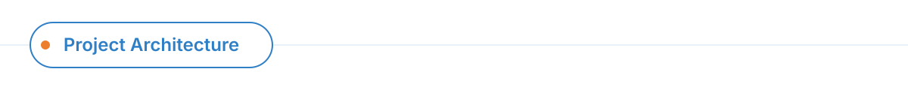
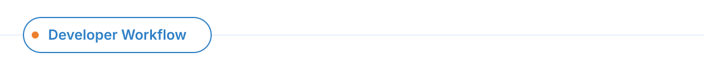

<div align="center">
  
</div>

<br/>

The official portfolio platform for **Think UX**. Built to showcase high-fidelity brand strategy, visual identities, campaigns, and digital experiences across India, utilizing a modern, animation-rich frontend stack.

## Showcase

Currently shipping bespoke experiences for major brands, including **Marigold** (Banquets 'N' Conventions), **Endo Lighting** (Japanese lighting brand), and our core service pillars: **About Us**, **Services**, and **Strategic Consulting**.

<div align="center">
  
</div>

### Component & Asset Strategy

The platform relies on a strict separation of the codebase and heavy graphical assets.
- **Shared Chrome:** The `<ThinkUxLogo>`, `<PillButtons>`, and the `<ClientCarousel>` (footer marquee) are embedded directly within the content boundaries, ensuring seamless scrolling and a distinct agency feel.
- **Design Tokens:** Tailwind CSS v4 is used extensively, leveraging CSS-based `@theme` tokens in `app/globals.css` (e.g., `--brand-blue`, `--brand-orange`) rather than a traditional config file.
- **Local Assets:** Heavy design assets (over 1.7GB) are housed externally and symlinked into `public/assets/`, keeping the repository extremely lean and fast.

<div align="center">
  
</div>

### Running Locally

```bash
# Start the Turbopack development server
npm run dev
# Running at http://localhost:3000
```

### Adding a New Brand Showcase

Adding a new brand case study is designed to be frictionless:

1. **Link Assets:** Copy the brand's asset folder from the external drive into the public directory:
   ```bash
   cp -r "/Volumes/Soham/ThinkUX/Think UX Website Assets/<Brand Name>" public/assets/
   ```
2. **Register Data:** Add the brand configuration to `lib/brands.ts` as `<brand>Main` and `<brand>CaseStudy`.
3. **Build Routes:**
   - Create `app/<brand>/page.tsx` and import `MainPageLayout`.
   - Create `app/<brand>/case-study/page.tsx` and utilize `CaseStudyLayout` for symmetric grids.
4. **Deploy:** Commit and push. Vercel handles the static export and CDN distribution automatically.

### Verification

Always verify image paths and static generation before deployment:
```bash
npm run build
```

---

**Stack Overview:** Next.js 16 (App Router) • React 19 • Tailwind CSS v4 • Framer Motion
