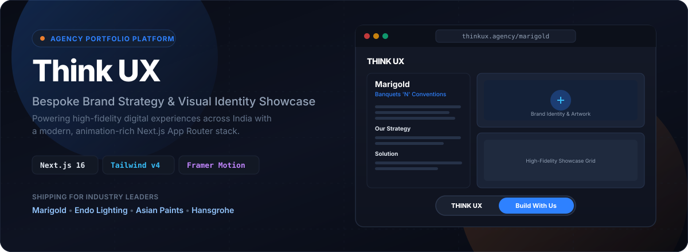
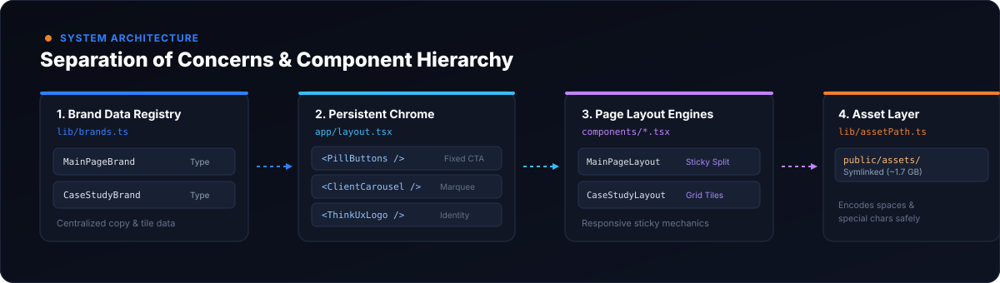
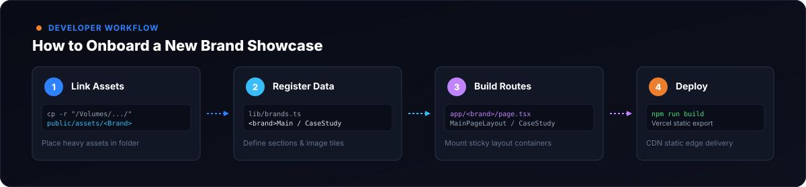

<p align="center">
  
</p>

<br/>

The official portfolio platform for **Think UX** — engineered to showcase high-fidelity brand strategy, visual identities, campaigns, and digital experiences across India, utilizing a modern, animation-rich Next.js App Router stack.

---

## Showcase

Currently shipping bespoke experiences for major brands, including **Marigold** (Banquets ‘N’ Conventions), **Endo Lighting** (Japanese lighting brand), and core agency pillars: **About Us**, **Services**, and **Strategic Consulting**.

- **Marigold Banquets ‘N’ Conventions** — Elevated 5-star venue positioning in Western Pune through calligraphic wordmark identity, illustrative storytelling, and zero-spoiler experience strategy.
- **Endo Lighting** — Osaka-founded precision lighting systems. Interactive narrative showcasing adaptive illumination, glareless engineering, and architectural harmony for the Indian market.

---

<p align="center">
  
</p>

### Component & Asset Strategy

The platform relies on a strict separation of the codebase and heavy graphical assets (~1.7GB):

- **Shared Chrome:** The `<ThinkUxLogo>`, `<PillButtons>` (floating CTA pill), and `<ClientCarousel>` (footer marquee) are embedded directly within content boundaries, ensuring seamless scrolling and a distinct agency feel.
- **Design Tokens:** Tailwind CSS v4 is used extensively, leveraging CSS-based `@theme` tokens in `app/globals.css` (e.g., `--brand-blue: #2e81ff`, `--brand-blue-soft: #e8f1fa`, `--brand-orange: #ec7f2e`) rather than a legacy config file.
- **Asset Isolation:** Heavy design assets are housed externally and symlinked into `public/assets/`, keeping the repository extremely lean and fast. Access is wrapped by `lib/assetPath.ts` to URL-encode filenames with spaces and special characters.

---

<p align="center">
  
</p>

### Running Locally

```bash
# Start the Turbopack development server
npm run dev

# App runs at http://localhost:3000
```

### Adding a New Brand Showcase

Adding a new brand case study is designed to be frictionless:

1. **Link Assets:** Copy the brand's asset folder into the `public/assets/` directory:
   ```bash
   cp -r "/Volumes/Soham/ThinkUX/Think UX Website Assets/<Brand Name>" public/assets/
   ```
2. **Register Data:** Add the brand configuration to `lib/brands.ts` as `<brand>Main` and `<brand>CaseStudy`.
3. **Build Routes:**
   - Create `app/<brand>/page.tsx` and import `MainPageLayout`.
   - Create `app/<brand>/case-study/page.tsx` and utilize `CaseStudyLayout` for symmetric grids or custom masonry tiles.
4. **Deploy:** Run verification build and push to trigger automated static export and Vercel CDN distribution.

### Verification

Always verify image paths and static generation before deployment:

```bash
npm run build
```

---

<p align="center">
  <b>Stack Overview</b><br/>
  Next.js 16 (App Router) &nbsp;•&nbsp; React 19 &nbsp;•&nbsp; Tailwind CSS v4 &nbsp;•&nbsp; Framer Motion &nbsp;•&nbsp; TASA Orbiter
</p>
